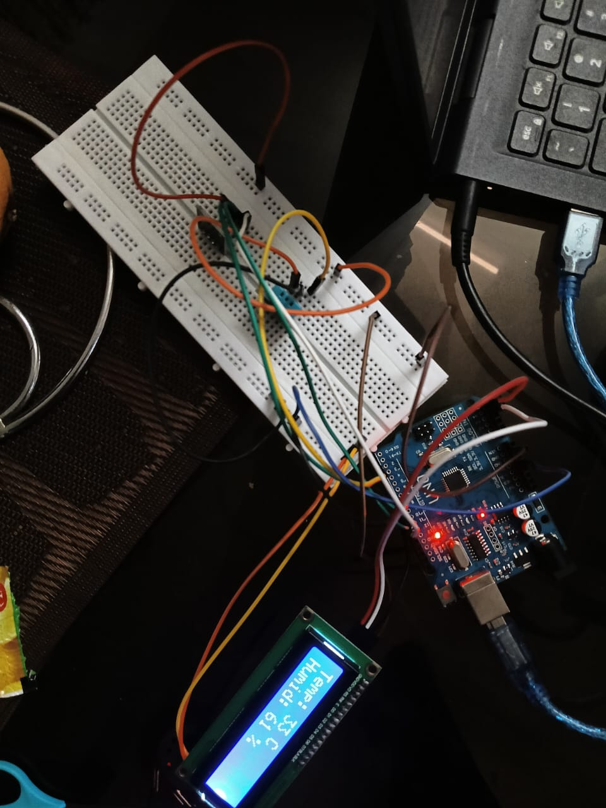

# Temperature and Humidity Detection System

An Arduino-based environmental monitoring system that measures real-time ambient temperature and humidity levels using a DHT11 sensor.

## 🚀 Features
* **Live Climate Tracking:** Continuous monitoring of ambient relative humidity (%) and temperature (°C).
* **Visual Readout:** Displays real-time data clearly on an LCD screen.

## 🛠️ Hardware Components
* **Arduino Board** (Microcontroller)
* **DHT11 Sensor** (Blue Temperature & Humidity Sensor)
* **16x2 I2C LCD Display**
* **Connecting Wires**

## 📌 Circuit Pin Mapping

| Component Pin | Arduino Pin | Description |
| :--- | :--- | :--- |
| **DHT11 Data** | Pin 2 | Digital input for climate data |
| **I2C LCD SDA** | Pin A4 | Serial Data Line |
| **I2C LCD SCL** | Pin A5 | Serial Clock Line |

## 📷 Circuit Setup

